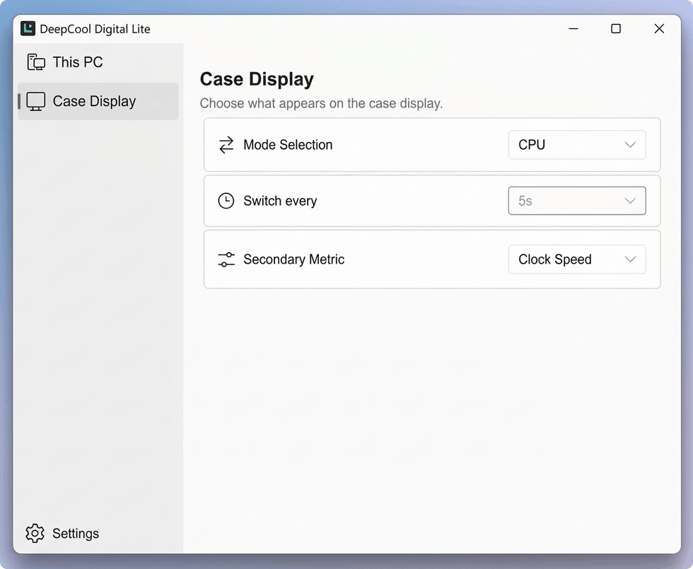

# DeepCool Digital Lite

[English](README.md) | 简体中文

一款适用于 DeepCool CH270 DIGITAL 机箱屏幕的轻量级 Rust 托盘应用。
它可以显示 CPU 或 GPU 的温度、功耗、使用率和一项辅助指标。MIX 模式会在
CPU 与 GPU 页面之间轮换。



## 为什么开发这个项目

DeepCool 官方软件可以驱动这块硬件，但它会运行多个桌面进程和后台服务。
在我的电脑上，内存占用是我想要开发一个更轻量替代品的主要原因。
DeepCool Digital Lite 专注于 CH270 屏幕，使用一个轻量的 Rust 托盘应用和
内置的传感器桥接程序。

- **开源：** 应用程序和传感器桥接程序均可在此仓库中查看并自行构建。
- **占用更低：** 精简的功能使其在开发所用的电脑上明显减少了内存占用。
- **本地运行：** 应用程序不包含遥测或网络请求代码；传感器数据只保留在
  本机，并发送到机箱屏幕。

| 同一台电脑上的快照 | DeepCool 官方软件 | DeepCool Digital Lite |
| --- | ---: | ---: |
| 进程数 | 8 | 2 |
| 工作集内存 | 692 MB | 38 MB |
| 专用内存 | 492 MB | 20 MB |

官方软件的测量结果包括六个应用进程和两个服务。Lite 的测量结果包括 Rust
应用和 Sensor Bridge。两组数据来自同一台 Windows 电脑，但采集时间不同，
因此它们只是当时的快照，并非通用性能基准。

## 兼容性

DeepCool Digital Lite 目前仅在 **DeepCool CH270 DIGITAL** 机箱屏幕上测试通过。
尚未测试其他 DeepCool 数显产品，因此无法保证兼容性。

目前无法正常读取 GPU 功耗，因此 GPU 和 MIX 模式会显示 `0 W`。后续有时间时
会再更新支持。

## 运行包

请使用完整的 `dist` 文件夹。`deepcool-digital-lite.exe` 需要旁边附带的
`sensor-bridge` 目录。Sensor Bridge 使用 LibreHardwareMonitor 读取传感器，
因此不需要安装 Fan Control。

Lite 控制屏幕时，必须停止 DeepCool 官方显示服务。
`dist\Toggle-DeepCool-Services.cmd` 可以切换这些服务的运行状态，且不会更改
它们的启动类型。

## 构建

双击 `Build-Release.cmd`，或运行：

```powershell
powershell -ExecutionPolicy Bypass -File .\scripts\Build-Release.ps1
```

该脚本会从源码重新构建 `SensorBridge.exe`，构建 Rust release 可执行文件，
并更新 `dist` 中所需的运行文件。

## 设置

显示设置保存在 `%APPDATA%\DeepCoolDigitalLite`。`Start with Windows` 选项会在
Windows 任务计划程序中创建 `DeepCoolDigitalLite` 任务，并在用户登录时使用
`--minimized` 参数启动当前可执行文件。

## 许可证

<a href="https://slint.dev/"></a>

项目代码采用 [MIT License](LICENSE)。捆绑依赖项的许可证列在
[THIRD-PARTY-NOTICES.md](THIRD-PARTY-NOTICES.md) 中。

本项目基于 sukualam 的
[deepcool-digital-windows](https://github.com/sukualam/deepcool-digital-windows)。
原项目的版权声明已保留在许可证中。
